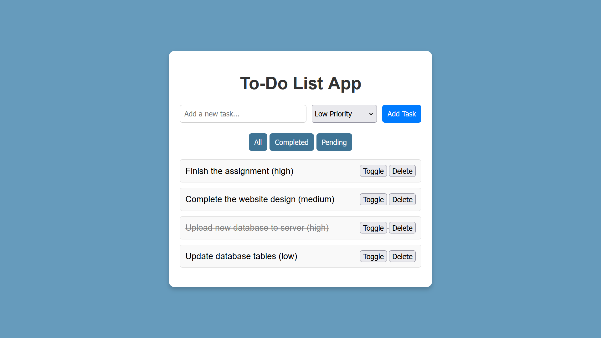

# 📝 To-Do List App

A dynamic and interactive To-Do List application built with **HTML**, **CSS**, and **JavaScript**. This app helps you efficiently manage your tasks with features like custom categories, priorities, filters, and persistent data storage.

## 🚀 Features
- **Add Tasks:** Easily add tasks with specific categories and priorities.
- **Custom Categories:** Create unique categories tailored to your needs.
- **Prioritize Tasks:** Assign priorities (High, Medium, Low) for better task management.
- **Mark as Complete:** Toggle tasks as completed and keep track of progress.
- **Delete Tasks:** Safely delete tasks with confirmation prompts.
- **Persistent Data:** Save and retrieve tasks using Local Storage, ensuring your tasks are always available.
- **Filter Tasks:** Display tasks based on their category or completion status.
- **User-Friendly Design:** A responsive and intuitive interface with a two-panel layout for better organization.

## 📸 Screenshot



## 📂 Directory Structure
```plaintext
to-do-list/
├── assets/
│   └── screenshot.png
├── index.html
├── styles.css
├── script.js
├── LICENSE
└── README.md
```

## 📖 Usage
1. Clone the repository:
    ```bash
    git clone https://github.com/marwan-ahmed-23/to-do-list.git
    ```
2. Open the project folder:
    ```bash
    cd to-do-list
    ```
3. Open `index.html` in your browser.
4. Start adding tasks, selecting categories, and setting priorities!

## 🌟 Examples of Input

Here are some examples of tasks you can add:

	1.	Task: “Finish project report”
        Category: Work
        Priority: High
        
	2.	Task: “Buy groceries”
        Category: Shopping
        Priority: Medium
        
	3.	Task: “Morning run”
        Category: Fitness
        Priority: Low
        
	4.	Task: “Read a book”
        Category: Personal
        Priority: Medium

## 🤝 Contributions

Contributions are welcome! Here's how you can contribute:

1. Fork the repository.
2. Create a new branch for your feature or bug fix:
    ```bash
    git checkout -b feature-name
    ```
3. Commit your changes:
    ```bash
    git commit -m "Added a new feature"
    ```
4. Push your branch:
    ```bash
    git push origin feature-name
    ```
5. Submit a pull request with details about your changes.


## 🛠 Future Improvements
- **Task Deadlines:** Add a deadline feature with a calendar selector.
- **Task Sorting:** Implement sorting options by priority or completion status.
- **Advanced Search:** Enable users to search tasks by category or keywords.
- **Theme Customization:** Add light and dark mode themes for better usability.
- **Notifications:** Integrate notifications for task deadlines.

## 🌟 Stay Connected
If you find this project helpful, please star ⭐ the repository to show your support!
