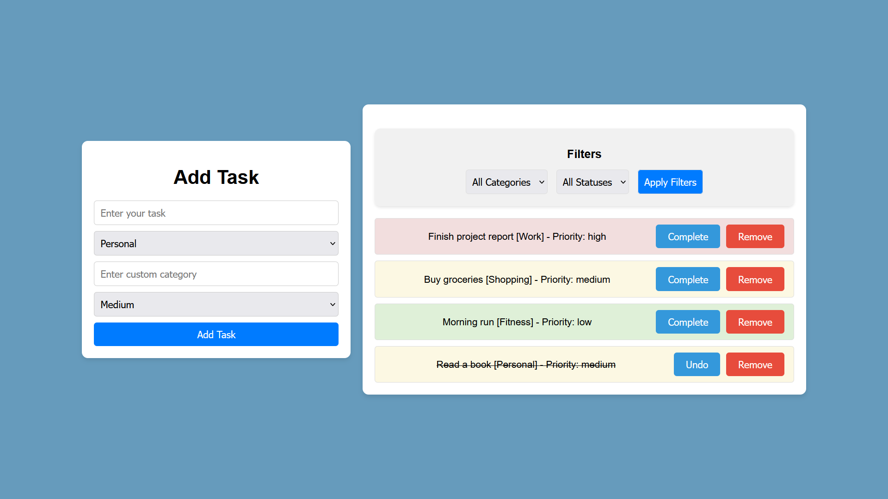

# To-Do List App

A simple and interactive To-Do List application built with HTML, CSS, and JavaScript. It allows users to add, mark, and remove tasks, making task management easy and efficient.

## 🚀 Features
- **Add Tasks**: Quickly add new tasks to your to-do list.
- **Mark as Complete**: Mark tasks as completed to keep track of progress.
- **Delete Tasks**: Remove tasks once they are no longer needed.

## 📸 Screenshot



## 📂 Directory Structure
```plaintext
to-do-list/
├── assets/
│   └── screenshot.png
├── index.html
├── styles.css
├── script.js
├── LICENSE
└── README.md
```

## 📖 Usage
1. Clone the repository:
    ```bash
    git clone https://github.com/marwan-ahmed-23/to-do-list.git
    ```
2. Open `index.html` in your browser.

## 🤝 Contributing
Contributions are welcome! Fork the repository and submit a pull request for any enhancements or bug fixes.

## 🌟 Stay Connected
Feel free to star ⭐ this repository if you find it helpful!
